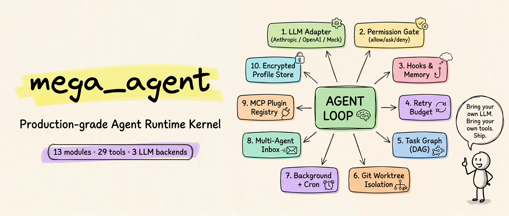
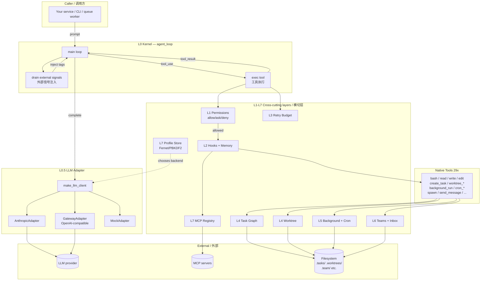

# mega_agent

> Production-grade Agent runtime kernel — bring your own LLM key, tools, and business logic.
> 工业级 Agent 运行时内核 —— 自带 LLM Key、自带工具、自带业务逻辑,即插即用。

[](https://www.python.org/)
[](LICENSE)
[](mega_agent/__init__.py)



---

## 🌍 Overview / 概览

**EN —** `mega_agent` is a **layered, replaceable, batteries-included** Python package that turns an LLM into a real agent: tool calling, permission gating, error self-healing, task isolation, scheduling, encrypted credentials, and MCP plugin support — all in 13 small modules you can read in an afternoon. It is **not** another wrapper that ties you to one vendor. It is a kernel: pick your LLM, register your tools, embed it into your service.

**中文 —** `mega_agent` 是一个**分层、可替换、开箱即用**的 Python 包,把任意 LLM 变成可执行的 Agent:工具调用、权限管控、错误自愈、任务隔离、调度、加密凭据、MCP 插件 —— 全部装进 13 个一下午就能读完的小模块里。它**不是**又一个把你绑死在某厂商的封装层,而是一个**内核**:挑你的 LLM,注册你的工具,嵌进你的服务。

---

## ✨ Highlights / 核心亮点

| EN | 中文 |
|---|---|
| **Drop-in embed** — `from mega_agent import agent_loop`, three lines and you're running. | **三行嵌入** —— `from mega_agent import agent_loop`,三行代码就能跑起来。 |
| **Vendor-neutral** — `anthropic` SDK, any OpenAI-compatible gateway (OpenAI / LiteLLM / OpenRouter / vLLM / your own), or a deterministic `mock` backend for tests. | **厂商中立** —— 原生 `anthropic`,任意 OpenAI 兼容网关(OpenAI / LiteLLM / OpenRouter / vLLM / 自建),或确定性 `mock` 后端供测试。 |
| **29 native tools** — file IO, shell, task graph, git worktree, background runner, cron, multi-agent inbox. | **29 个内置工具** —— 文件读写、Shell、任务图、git worktree、后台执行器、Cron、多 Agent 收件箱。 |
| **Encrypted profile store** — Fernet + PBKDF2-HMAC-SHA256 (200,000 iterations); zero-config plaintext fallback for dev. | **加密 Profile 仓库** —— Fernet + PBKDF2-HMAC-SHA256(20 万轮);零配置时降级为明文供本地调试。 |
| **Semantic routing** — `@code` → Claude, `@write` → GPT-4o, default → in-house gateway. | **语义路由** —— `@code` 走 Claude,`@write` 走 GPT-4o,默认走自建网关。 |
| **Three-state permission gate** — `allow / ask / deny`, classified by tool name and command shape. | **三态权限闸** —— `allow / ask / deny`,根据工具名与命令形态自动分级。 |
| **Errors are observations** — failed tool calls become `is_error=True` results so the LLM can choose another path, not crash. | **错误即观察** —— 工具调用失败转化为 `is_error=True` 的结果让 LLM 重新决策,而不是把 loop 炸掉。 |
| **Retry budget** — tools that fail N times in a row are auto-disabled and the LLM is told. | **重试预算** —— 连续失败 N 次的工具自动禁用并通知 LLM。 |
| **MCP support** — connect any MCP server with one line: `mcp.register("server", ["cmd"])`. | **MCP 插件** —— 一行接入任意 MCP server:`mcp.register("server", ["cmd"])`。 |

---

## 🏗 Architecture / 架构

**EN —** Every prompt enters the kernel; the kernel asks an `LLMClient` for the next action, dispatches any `tool_use` block through the permission gate and hook chain into either a native handler or an MCP server, captures the result (success *or* error) as a `tool_result`, then loops until the LLM emits `end_turn`.

**中文 —** 每条 prompt 进入内核;内核向 `LLMClient` 索取下一步动作,把 `tool_use` 块经权限闸 + 钩子链派发到原生 handler 或 MCP server,把结果(成功或失败)封装成 `tool_result` 回灌,如此循环直到 LLM 输出 `end_turn`。



### Module map / 模块地图

| File | Layer | EN Responsibility | 中文职责 |
|---|---|---|---|
| `config.py` | — | Path layout + env vars + git root detection | 路径布局 + 环境变量 + git 根目录探测 |
| `events.py` | — | Append-only JSONL event bus | 仅追加 JSONL 事件总线 |
| `permissions.py` | L1 | Capability gate, three-state decision | 能力闸,三态决策 |
| `hooks.py` | L2 | Synchronous hook bus + memory + system prompt | 同步钩子 + 记忆 + 系统提示词 |
| `retry.py` | L3 | Per-tool failure budget with auto-disable | 按工具粒度的失败预算与自动禁用 |
| `tasks.py` | L4 | DAG task store (one JSON file per task) | DAG 任务仓库(每任务一个 JSON 文件) |
| `worktree.py` | L4 | Git-worktree wrapper with task binding | git-worktree 封装,与任务绑定 |
| `background.py` | L5 | Background subprocess runner + priority queue + cron | 后台子进程执行器 + 优先队列 + Cron |
| `teams.py` | L6 | Multi-agent inbox + protocol request ledger | 多 Agent 收件箱 + 协议请求账本 |
| `mcp.py` | L7 | Stdio + JSON-RPC 2.0 MCP client/registry | Stdio + JSON-RPC 2.0 MCP 客户端/注册表 |
| `profiles.py` | L7 | Encrypted profile store + routing table | 加密 Profile 仓库 + 路由表 |
| `llm/` | L0.5 | LLMClient protocol + 3 adapters + factory | LLMClient 协议 + 3 个适配器 + 工厂 |
| `tools.py` | — | 29 native tool handlers + schema builder | 29 个原生工具 + Schema 构造器 |
| `kernel.py` | L0 | The agent loop | Agent 主循环 |
| `cli.py` | — | Reference REPL | 参考 REPL |

---

## 📦 Install / 安装

```bash
git clone https://github.com/wangxfholly/agent_basic.git
cd agent_basic
pip install -r requirements.txt
```

Requirements (Python 3.10+) / 依赖(需 Python 3.10+):

| Package | Required when / 何时需要 |
|---|---|
| `anthropic` | Using the `anthropic` protocol / 使用 anthropic 协议时 |
| `openai` | Using the `openai` protocol (covers ANY OpenAI-compatible gateway) / 使用 openai 协议时(覆盖一切 OpenAI 兼容网关) |
| `cryptography` | `AGENT_MASTER_PASSWORD` is set (encrypted profile store) / 设置了 `AGENT_MASTER_PASSWORD`(开启加密 Profile)时 |

Install only what you need; the others stay as soft imports. / 按需安装,其他保持软导入。

---

## 🚀 Quick start / 快速开始

### Option A — REPL 交互模式

```bash
export ANTHROPIC_API_KEY=sk-ant-xxxxx
python -m mega_agent
```

```
== mega_agent ==
WORKDIR   = /your/cwd
tools     = 29 native + 0 mcp
secrets   = DISABLED (plaintext)
profile   = (none — use /add-profile or env)
you> list files in this dir and tell me how many
```

### Option B — Embed in your service / 嵌入你的服务

```python
from mega_agent import agent_loop

def handle_request(prompt: str) -> str:
    msgs = agent_loop(prompt)
    last = msgs[-1]["content"]
    return "\n".join(
        b.text for b in last
        if getattr(b, "type", None) == "text"
    )
```

**EN —** That's it. `agent_loop` is thread-safe; state persists in `.tasks/`, `.worktrees/`, etc. under `AGENT_WORKDIR`.

**中文 —** 就这么多。`agent_loop` 线程安全,状态持久化在 `AGENT_WORKDIR` 下的 `.tasks/`、`.worktrees/` 等目录。

### Examples / 示例

| File | EN Demonstrates | 中文说明 |
|---|---|---|
| [`01_quickstart.py`](examples/01_quickstart.py) | Minimal embed | 最小化嵌入 |
| [`02_custom_tool.py`](examples/02_custom_tool.py) | Register your own business tools | 注册自有业务工具 |
| [`03_hooks.py`](examples/03_hooks.py) | Audit / metering / compliance via hooks | 通过钩子做审计 / 计量 / 合规 |
| [`04_routing.py`](examples/04_routing.py) | Multi-profile + semantic routing programmatically | 编程方式配置多 Profile + 语义路由 |
| [`05_mock_test.py`](examples/05_mock_test.py) | Deterministic unit tests with `MockAdapter` | 用 `MockAdapter` 写确定性单测 |

---

## 🔑 Configuring LLM backends / LLM 后端配置

### Single key, single model (env-only) / 单 Key 单模型(纯环境变量)

```bash
export ANTHROPIC_API_KEY=sk-ant-xxx
# 或任意 OpenAI 兼容网关 / or any OpenAI-compatible gateway:
export AGENT_LLM_BACKEND=gateway
export AGENT_GATEWAY_BASE_URL=https://api.openai.com/v1
export AGENT_GATEWAY_API_KEY=sk-xxx
export AGENT_MODEL=gpt-4o
```

### Multiple keys + routing (recommended for prod) / 多 Key + 路由(生产推荐)

```bash
export AGENT_MASTER_PASSWORD='choose a strong passphrase'
python -m mega_agent
```

In the REPL / REPL 内:

```
you> /add-profile
  name      : claude
  protocol  : anthropic
  model     : claude-sonnet-4-20250514
  api_key   : sk-ant-xxx

you> /add-profile
  name      : gpt4o
  protocol  : openai
  base_url  : https://api.openai.com/v1
  api_key   : sk-xxx
  model     : gpt-4o

you> /route code claude
you> /route write gpt4o
you> /route default claude

you> @code   write me a binary search in Python
you> @write  rewrite the comments above in plain English
you> a generic question goes through the default route
```

**EN —** Profiles are persisted to `models.json.enc` (Fernet ciphertext) when `AGENT_MASTER_PASSWORD` is set, otherwise to `models.json` (plaintext, with a one-time warning).

**中文 —** 设置了 `AGENT_MASTER_PASSWORD` 时 Profile 落盘为 `models.json.enc`(Fernet 密文),否则落盘为 `models.json`(明文,首次会有警告)。

---

## 🔧 Adding your own tools / 注册自定义工具

Three lines / 三行搞定:

```python
from mega_agent import TOOL_HANDLERS, agent_loop

def query_user(inp: dict) -> dict:
    return my_db.fetch_user(inp["user_id"])

TOOL_HANDLERS["query_user"] = query_user

agent_loop("Look up user u123 and summarise their recent activity.")
```

**EN —** The kernel picks up the new handler the next time `build_tool_schemas()` runs (which is once per `agent_loop` call). The LLM sees `query_user` automatically. For a richer schema, see the inline notes in [`mega_agent/tools.py`](mega_agent/tools.py).

**中文 —** 内核会在下次 `build_tool_schemas()` 时自动拾取新 handler(每次 `agent_loop` 调用前会跑一次),LLM 自动看到 `query_user`。需要更详尽 schema 见 [`mega_agent/tools.py`](mega_agent/tools.py) 内注释。

---

## 🪝 Cross-cutting via hooks / 用钩子做横切

**EN —** Hooks run synchronously in the calling thread; ideal for audit logs, metering, rate limits, and PII scrubs.

**中文 —** 钩子在调用线程内同步执行;适合审计日志、计量、限流、PII 脱敏。

| Event | Payload |
|---|---|
| `tool.before` | `{name, input, intent}` |
| `tool.after` | `{name, intent, ok}` |
| `tool.error` | `{name, intent, error}` |
| `loop.iter` | `{iter, backend}` |

```python
from mega_agent import hooks

def audit(payload):
    log.info("tool=%s risk=%s", payload["name"], payload["intent"]["risk"])

hooks.on("tool.before", audit)
```

Full demo: [`examples/03_hooks.py`](examples/03_hooks.py). / 完整示例见 [`examples/03_hooks.py`](examples/03_hooks.py)。

---

## 🛡 Permission model / 权限模型

The gate classifies every call / 闸对每次调用进行分级:

| Risk / 风险 | Trigger / 触发条件 | `auto` mode | `strict` mode |
|---|---|---|---|
| `read` | Tool name starts with `read/list/get/show/search/query/inspect` | **allow** | **allow** |
| `write` | Anything else not flagged below / 其他未命中下方规则的 | **allow** | **ask** |
| `high` | Tool starts with `delete/remove/drop/rm/kill/shutdown`, or bash contains `rm -rf` / `shutdown` / `mkfs` / `dd if=` | **ask** | **ask** |

**EN —** `ask` in non-interactive runs auto-denies. Wrap `kernel._exec_tool` or extend `cli.py` to plug in your own UI prompt and call `permissions.remember(name, "allow")` to whitelist.

**中文 —** 非交互场景下 `ask` 默认拒绝。可以包装 `kernel._exec_tool` 或扩展 `cli.py` 接入你自己的 UI 询问,然后调用 `permissions.remember(name, "allow")` 加白。

```python
from mega_agent import permissions
permissions.allowlist.add("query_user")        # always allow / 永远放行
permissions.denylist.add("shutdown_teammate")  # never run / 永远禁止
permissions.mode = "strict"                    # globally tighter / 全局收紧
```

---

## 🛟 Reliability features / 可靠性特性

### Errors are observations / 错误即观察

**EN —** A tool that raises is *not* propagated out of `agent_loop`. The kernel converts the exception into:

**中文 —** 工具抛错**不会**穿出 `agent_loop`。内核会把异常转成:

```json
{"type": "tool_result", "is_error": true, "content": "ERROR: <msg>"}
```

**EN —** The LLM reads it on the next turn and decides whether to retry, change strategy, or surface the failure to the user.

**中文 —** LLM 在下一轮读到后,自行决定重试、换策略,还是把失败回报给用户。

### Retry budget / 重试预算

**EN —** Each tool tracks its consecutive-failure count. After `AGENT_RETRY_THRESHOLD` (default 3) failures it is **disabled**, and the next user turn carries:

**中文 —** 每个工具记录自己的**连续失败计数**。超过 `AGENT_RETRY_THRESHOLD`(默认 3 次)后被**禁用**,下一轮用户消息会被注入:

```
<retry-budget>tools temporarily disabled: bash,query_user</retry-budget>
```

```bash
export AGENT_RETRY_THRESHOLD=5
```

### Worktree isolation / 工作树隔离

**EN —** Spawn parallel subtasks without races. / **中文 —** 并发子任务零竞态:

```
you> create_task title="implement A"   → t1
you> create_worktree name=feat-a task_id=t1
you> run_in_worktree feat-a "pytest"
you> worktree_closeout feat-a action=remove complete_task=true
```

**EN —** Each worktree is a real `git worktree add`, on its own branch (`wt/<name>`). Multiple subagents can edit files in isolation; `worktree_closeout` either keeps or removes the branch and updates the bound task.

**中文 —** 每个 worktree 都是真实的 `git worktree add`,独立分支(`wt/<name>`)。多个子 Agent 可以在文件层面互不干扰;`worktree_closeout` 可选保留或删除分支,并同步更新绑定任务。

---

## 🔌 MCP plugins / MCP 插件

```python
from mega_agent import mcp
mcp.register("filesystem", ["mcp-server-filesystem", "/path/to/root"])
mcp.register("github",     ["mcp-server-github"])
```

**EN —** All registered tools appear automatically in `build_tool_schemas()` under names `mcp__<server>__<tool>`. The permission gate treats them like native tools (their risk is inferred from the name prefix).

**中文 —** 所有注册的工具会自动出现在 `build_tool_schemas()` 中,命名为 `mcp__<server>__<tool>`。权限闸对它们的处理与原生工具完全一致(基于名称前缀推导风险)。

---

## ⚙️ Configuration reference / 配置参考

### Environment variables / 环境变量

| Var / 变量 | Default / 默认 | EN Purpose | 中文用途 |
|---|---|---|---|
| `AGENT_WORKDIR` | `.` | State root (`.tasks/`, `.worktrees/`, etc.) | 状态根目录 |
| `AGENT_MODEL` | `claude-sonnet-4-20250514` | Default model when no profile is active | 无 Profile 激活时的默认模型 |
| `AGENT_MAX_ITERS` | `50` | Kernel loop safety cap | 内核循环安全上限 |
| `AGENT_PERM_MODE` | `auto` | `auto` \| `strict` | 权限模式 |
| `AGENT_RETRY_THRESHOLD` | `3` | Failures before auto-disable | 自动禁用前允许失败次数 |
| `AGENT_LLM_BACKEND` | `anthropic` | `anthropic` \| `gateway` \| `mock` (legacy fallback when no profile) | 后端类型(无 Profile 时使用) |
| `AGENT_LLM_PROFILE` | _(empty)_ | Profile to activate at startup | 启动时激活的 Profile 名 |
| `AGENT_GATEWAY_BASE_URL` | _(empty)_ | OpenAI-compatible gateway URL | OpenAI 兼容网关 URL |
| `AGENT_GATEWAY_API_KEY` | _(empty)_ | Gateway key | 网关 Key |
| `OPENAI_BASE_URL` / `OPENAI_API_KEY` | _(empty)_ | Accepted as fallback | 作为兜底接受 |
| `ANTHROPIC_API_KEY` | _(empty)_ | Anthropic native key | Anthropic 原生 Key |
| `AGENT_MASTER_PASSWORD` | _(empty)_ | **Set this to enable Fernet encryption of `models.json`** | **设置后开启 `models.json` 的 Fernet 加密** |

### REPL commands / REPL 命令

| Command / 命令 | EN Action | 中文 |
|---|---|---|
| `/profiles` | List profiles (api_keys redacted) | 列出 Profile(脱敏 Key) |
| `/use <name>` | Switch active profile | 切换激活 Profile |
| `/add-profile` | Interactive add | 交互式添加 |
| `/rm-profile <name>` | Delete | 删除 |
| `/routes` | Show routing table | 查看路由表 |
| `/route <key> <profile>` | Map a semantic key to a profile | 把语义键绑到 Profile |
| `/rm-route <key>` | Drop a route | 删除路由 |
| `/perm auto\|strict` | Toggle permission mode | 切换权限模式 |
| `/backend anthropic\|gateway\|mock` | Override backend for new clients | 覆盖新客户端的后端 |
| `@<route> <prompt>` | Dispatch this turn through a route | 此轮按路由派发 |
| `/quit` | Exit | 退出 |

### Runtime files (all in `.gitignore`) / 运行时文件(全部已在 `.gitignore`)

| Path / 路径 | EN | 中文 |
|---|---|---|
| `.tasks/` | Task graph nodes (one JSON per task) | 任务图节点(每任务一个 JSON) |
| `.worktrees/` | Git-worktree checkouts + index | git-worktree 检出 + 索引 |
| `.runtime-tasks/` | Background-run archives | 后台运行档案 |
| `.cron/` | Cron job records | Cron 任务记录 |
| `.team/` | Multi-agent inboxes + config | 多 Agent 收件箱 + 配置 |
| `models.json` / `models.json.enc` | Profile store (plaintext or encrypted) | Profile 仓库(明文或加密) |
| `.master-key.salt` | PBKDF2 salt for the encrypted store | 加密仓库的 PBKDF2 盐 |
| `CLAUDE.md` | Project memory injected into the system prompt | 注入系统提示词的项目记忆 |
| `.hooks.json` | User-defined hook declarations | 用户定义的钩子声明 |

---

## 🧱 Extending / 扩展指南

| Goal / 目标 | Where / 着手处 |
|---|---|
| New tool / 新工具 | `tools.py` → add handler + register on `TOOL_HANDLERS` |
| New LLM backend / 新 LLM 后端 | Subclass `LLMClient` in `mega_agent/llm/`, register in `factory.py` |
| Audit / metering / rate-limit / 审计计量限流 | `hooks.on("tool.before"/"tool.after"/"tool.error", ...)` |
| Custom `ask` UI / 自定义 ask UI | Override `kernel._exec_tool`'s `ask` branch |
| Different storage (Redis / DB) / 换存储 | Replace IO in `tasks.py` / `teams.py` |
| Custom system prompt / 自定义系统提示词 | Override `hooks.build_system_prompt()` or write `CLAUDE.md` |

---

## 🎯 Design principles / 设计原则

1. **Errors are observations / 错误即观察。** Tool failures never crash the loop; they become `is_error=true` results the LLM can react to. / 工具失败不让 loop 崩,而是化为 `is_error=true` 结果让 LLM 自行应对。
2. **External signals converge into one channel / 外部信号汇聚单通道。** Background results, inbox messages, and retry-budget alerts are injected as `<tag>...</tag>` blocks in the next user turn — there is exactly one input surface. / 后台结果、收件箱消息、重试预算告警全部以 `<tag>...</tag>` 块注入下一轮用户消息 —— 输入面只有一个。
3. **One file per record / 一记录一文件。** Tasks, inbox messages, background-run archives are individual JSON / JSONL — git-friendly, no merge hell. / 任务、收件箱消息、后台档案各自独立 JSON / JSONL —— git 友好,没有合并地狱。
4. **Stdlib-only on the hot path / 热路径只用标准库。** Cron, task graph, event bus, MCP client all use only the standard library. SDK and crypto are soft imports. / Cron、任务图、事件总线、MCP 客户端全部仅依赖标准库,SDK 与加密库均为软导入。
5. **Config via env + JSON / 配置走环境变量 + JSON。** No yaml, no toml. Anything that fits in a Kubernetes ConfigMap, Docker env, or Vault secret works directly. / 不用 YAML,不用 TOML。能塞进 K8s ConfigMap、Docker env、Vault secret 的就能直接用。

---

## 📊 Status / 状态

`v0.2.0` — actively used; API surface stable for the public exports listed in [`mega_agent/__init__.py`](mega_agent/__init__.py).

`v0.2.0` —— 在线使用中;[`mega_agent/__init__.py`](mega_agent/__init__.py) 中的公开导出 API 表面稳定。

## 📜 License / 许可证

[MIT](LICENSE)
