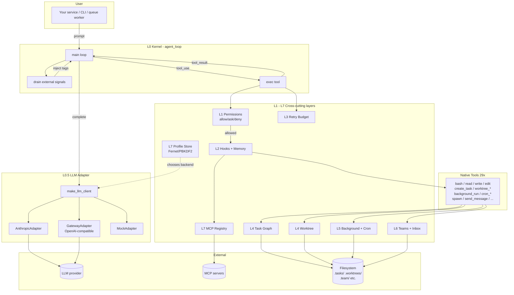

# mega_agent

> Production-grade Agent runtime kernel — bring your own LLM key, tools, and business logic.

[](https://www.python.org/)
[](LICENSE)

`mega_agent` is a **layered, replaceable, batteries-included** Python package that turns an LLM into a real agent: tool calling, permission gating, error self-healing, task isolation, scheduling, encrypted credentials, and MCP plugin support — all in 13 small modules you can read in an afternoon.

It is **not** another wrapper that ties you to one vendor. It is a kernel: pick your LLM, register your tools, embed it into your service.

---

## Highlights

- **Drop-in embed** — `from mega_agent import agent_loop`, three lines and you're running.
- **Vendor-neutral** — `anthropic` SDK, any OpenAI-compatible gateway (OpenAI / LiteLLM / OpenRouter / vLLM / your own), or a deterministic `mock` backend for tests.
- **29 native tools** — file IO, shell, task graph, git worktree, background runner, cron, multi-agent inbox.
- **Encrypted profile store** — Fernet + PBKDF2-HMAC-SHA256 (200,000 iterations); zero-config plaintext fallback for dev.
- **Semantic routing** — `@code` → Claude, `@write` → GPT-4o, default → in-house gateway.
- **Three-state permission gate** — `allow / ask / deny`, classified by tool name and command shape.
- **Errors are observations** — failed tool calls become `is_error=True` results so the LLM can choose another path, not crash.
- **Retry budget** — tools that fail N times in a row are auto-disabled and the LLM is told.
- **MCP support** — connect any MCP server with one line: `mcp.register("server", ["cmd"])`.

---

## Architecture



**Flow in one sentence:** every prompt enters the kernel, the kernel asks an `LLMClient` for the next action, dispatches any `tool_use` block through the permission gate and hook chain into either a native handler or an MCP server, captures the result (success *or* error) as a `tool_result`, then loops until the LLM emits `end_turn`.

### Module map

| File | Layer | Responsibility |
|---|---|---|
| `config.py` | — | Path layout + env vars + git root detection |
| `events.py` | — | Append-only JSONL event bus, shared across all layers |
| `permissions.py` | L1 | Capability gate, three-state decision |
| `hooks.py` | L2 | Synchronous in-process hook bus + memory + system prompt |
| `retry.py` | L3 | Per-tool failure budget with auto-disable |
| `tasks.py` | L4 | DAG task store (one JSON file per task) |
| `worktree.py` | L4 | Git-worktree wrapper with task binding |
| `background.py` | L5 | Background subprocess runner + priority queue + cron |
| `teams.py` | L6 | Multi-agent inbox + protocol request ledger |
| `mcp.py` | L7 | Stdio + JSON-RPC 2.0 MCP client/registry |
| `profiles.py` | L7 | Encrypted profile store + routing table |
| `llm/` | L0.5 | LLMClient protocol + 3 adapters + factory |
| `tools.py` | — | 29 native tool handlers + schema builder |
| `kernel.py` | L0 | The agent loop |
| `cli.py` | — | Reference REPL |

---

## Install

```bash
git clone https://github.com/wangxfholly/agent_basic.git
cd agent_basic
pip install -r requirements.txt
```

Requirements (Python 3.10+):

| Package | Required when |
|---|---|
| `anthropic` | Using the `anthropic` protocol |
| `openai` | Using the `openai` protocol (covers ANY OpenAI-compatible gateway) |
| `cryptography` | `AGENT_MASTER_PASSWORD` is set (encrypted profile store) |

Install only what you need; the others stay as soft imports.

---

## Quick start

### Option A — REPL

```bash
export ANTHROPIC_API_KEY=sk-ant-xxxxx
python -m mega_agent
```

```
== mega_agent ==
WORKDIR   = /your/cwd
tools     = 29 native + 0 mcp
secrets   = DISABLED (plaintext)
profile   = (none — use /add-profile or env)
you> list files in this dir and tell me how many
```

### Option B — Embed in your service

```python
from mega_agent import agent_loop

def handle_request(prompt: str) -> str:
    msgs = agent_loop(prompt)
    last = msgs[-1]["content"]
    return "\n".join(
        b.text for b in last
        if getattr(b, "type", None) == "text"
    )
```

That's it. `agent_loop` is thread-safe; state persists in `.tasks/`, `.worktrees/`, etc. under `AGENT_WORKDIR`.

See [`examples/`](examples/) for runnable scripts:

| File | Demonstrates |
|---|---|
| [`01_quickstart.py`](examples/01_quickstart.py) | Minimal embed |
| [`02_custom_tool.py`](examples/02_custom_tool.py) | Register your own business tools |
| [`03_hooks.py`](examples/03_hooks.py) | Audit / metering / compliance via hooks |
| [`04_routing.py`](examples/04_routing.py) | Multi-profile + semantic routing programmatically |
| [`05_mock_test.py`](examples/05_mock_test.py) | Deterministic unit tests with `MockAdapter` |

---

## Configuring LLM backends

### One key, one model (env-only)

```bash
export ANTHROPIC_API_KEY=sk-ant-xxx
# or for any OpenAI-compatible gateway:
export AGENT_LLM_BACKEND=gateway
export AGENT_GATEWAY_BASE_URL=https://api.openai.com/v1
export AGENT_GATEWAY_API_KEY=sk-xxx
export AGENT_MODEL=gpt-4o
```

### Multiple keys + routing (recommended for prod)

```bash
export AGENT_MASTER_PASSWORD='choose a strong passphrase'
python -m mega_agent
```

In the REPL:

```
you> /add-profile
  name      : claude
  protocol  : anthropic
  model     : claude-sonnet-4-20250514
  api_key   : sk-ant-xxx

you> /add-profile
  name      : gpt4o
  protocol  : openai
  base_url  : https://api.openai.com/v1
  api_key   : sk-xxx
  model     : gpt-4o

you> /route code claude
you> /route write gpt4o
you> /route default claude

you> @code   write me a binary search in Python
you> @write  rewrite the comments above in plain English
you> a generic question goes through the default route
```

Profiles are persisted to `models.json.enc` (Fernet ciphertext) when `AGENT_MASTER_PASSWORD` is set, otherwise to `models.json` (plaintext, with a one-time warning).

---

## Adding your own tools

Three lines:

```python
from mega_agent import TOOL_HANDLERS, agent_loop

def query_user(inp: dict) -> dict:
    return my_db.fetch_user(inp["user_id"])

TOOL_HANDLERS["query_user"] = query_user

agent_loop("Look up user u123 and summarise their recent activity.")
```

The kernel picks up the new handler the next time `build_tool_schemas()` runs (which is once per `agent_loop` call). The LLM sees `query_user` automatically.

For a richer schema (so the LLM knows the parameters), see the inline notes in [`mega_agent/tools.py`](mega_agent/tools.py).

---

## Cross-cutting via hooks

Hooks run synchronously in the calling thread; ideal for audit logs, metering, rate limits, and PII scrubs. Events emitted by the kernel:

| Event | Payload |
|---|---|
| `tool.before` | `{name, input, intent}` |
| `tool.after` | `{name, intent, ok}` |
| `tool.error` | `{name, intent, error}` |
| `loop.iter` | `{iter, backend}` |

Example:

```python
from mega_agent import hooks

def audit(payload):
    log.info("tool=%s risk=%s", payload["name"], payload["intent"]["risk"])

hooks.on("tool.before", audit)
```

Full demo: [`examples/03_hooks.py`](examples/03_hooks.py).

---

## Permission model

The gate classifies every call:

| Risk | Trigger | `auto` mode | `strict` mode |
|---|---|---|---|
| `read` | Tool name starts with `read/list/get/show/search/query/inspect` | **allow** | **allow** |
| `write` | Anything else not flagged below | **allow** | **ask** |
| `high` | Tool starts with `delete/remove/drop/rm/kill/shutdown`, or bash contains `rm -rf` / `shutdown` / `mkfs` / `dd if=` | **ask** | **ask** |

`ask` in non-interactive runs auto-denies. Wrap `kernel._exec_tool` or extend `cli.py` to plug in your own UI prompt and call `permissions.remember(name, "allow")` to whitelist.

Programmatic overrides:

```python
from mega_agent import permissions
permissions.allowlist.add("query_user")     # always allow
permissions.denylist.add("shutdown_teammate")  # never run
permissions.mode = "strict"                 # globally tighter
```

---

## Reliability features

### Errors are observations
A tool that raises is *not* propagated out of `agent_loop`. The kernel converts the exception into:

```json
{"type": "tool_result", "is_error": true, "content": "ERROR: <msg>"}
```

The LLM reads it on the next turn and decides whether to retry, change strategy, or surface the failure to the user.

### Retry budget
Each tool tracks its consecutive-failure count. After `AGENT_RETRY_THRESHOLD` (default 3) failures it is **disabled**, and the next user turn carries:

```
<retry-budget>tools temporarily disabled: bash,query_user</retry-budget>
```

Set the threshold via env:

```bash
export AGENT_RETRY_THRESHOLD=5
```

### Worktree isolation
Spawn parallel subtasks without races:

```
you> create_task title="implement A"   → t1
you> create_worktree name=feat-a task_id=t1
you> run_in_worktree feat-a "pytest"
you> worktree_closeout feat-a action=remove complete_task=true
```

Each worktree is a real `git worktree add`, on its own branch (`wt/<name>`). Multiple subagents can edit files in isolation; `worktree_closeout` either keeps or removes the branch and updates the bound task.

---

## MCP plugins

```python
from mega_agent import mcp
mcp.register("filesystem", ["mcp-server-filesystem", "/path/to/root"])
mcp.register("github",     ["mcp-server-github"])
```

All registered tools appear automatically in `build_tool_schemas()` under names `mcp__<server>__<tool>`. The permission gate treats them like native tools (their risk is inferred from the name prefix).

---

## Configuration reference

### Environment variables

| Var | Default | Purpose |
|---|---|---|
| `AGENT_WORKDIR` | `.` | State root (`.tasks/`, `.worktrees/`, etc.) |
| `AGENT_MODEL` | `claude-sonnet-4-20250514` | Default model when no profile is active |
| `AGENT_MAX_ITERS` | `50` | Kernel loop safety cap |
| `AGENT_PERM_MODE` | `auto` | `auto` \| `strict` |
| `AGENT_RETRY_THRESHOLD` | `3` | Failures before auto-disable |
| `AGENT_LLM_BACKEND` | `anthropic` | `anthropic` \| `gateway` \| `mock` (legacy fallback when no profile) |
| `AGENT_LLM_PROFILE` | _(empty)_ | Profile to activate at startup |
| `AGENT_GATEWAY_BASE_URL` | _(empty)_ | OpenAI-compatible gateway URL |
| `AGENT_GATEWAY_API_KEY` | _(empty)_ | Gateway key |
| `OPENAI_BASE_URL` / `OPENAI_API_KEY` | _(empty)_ | Accepted as fallback |
| `ANTHROPIC_API_KEY` | _(empty)_ | Anthropic native key |
| `AGENT_MASTER_PASSWORD` | _(empty)_ | **Set this to enable Fernet encryption of `models.json`** |

### REPL commands

| Command | Action |
|---|---|
| `/profiles` | List profiles (api_keys redacted) |
| `/use <name>` | Switch active profile |
| `/add-profile` | Interactive add (name / protocol / model / base_url / api_key) |
| `/rm-profile <name>` | Delete |
| `/routes` | Show routing table |
| `/route <key> <profile>` | Map a semantic key to a profile |
| `/rm-route <key>` | Drop a route |
| `/perm auto\|strict` | Toggle permission mode |
| `/backend anthropic\|gateway\|mock` | Override backend for new clients |
| `@<route> <prompt>` | Dispatch this turn through a route |
| `/quit` | Exit |

### Runtime files (all in `.gitignore`)

| Path | Description |
|---|---|
| `.tasks/` | Task graph nodes (one JSON per task) |
| `.worktrees/` | Git-worktree checkouts + index |
| `.runtime-tasks/` | Background-run archives |
| `.cron/` | Cron job records |
| `.team/` | Multi-agent inboxes + config |
| `models.json` / `models.json.enc` | Profile store (plaintext or encrypted) |
| `.master-key.salt` | PBKDF2 salt for the encrypted store |
| `CLAUDE.md` | Project memory injected into the system prompt |
| `.hooks.json` | User-defined hook declarations |

---

## Extending

| Goal | Where |
|---|---|
| New tool | `tools.py` → add handler + register on `TOOL_HANDLERS` |
| New LLM backend | Subclass `LLMClient` in `mega_agent/llm/`, register in `factory.py` |
| Audit / metering / rate-limit | `hooks.on("tool.before"/"tool.after"/"tool.error", ...)` |
| Custom `ask` UI | Override `kernel._exec_tool`'s `ask` branch |
| Different storage (Redis / DB) | Replace IO in `tasks.py` / `teams.py` |
| Custom system prompt | Override `hooks.build_system_prompt()` or write `CLAUDE.md` |

---

## Design principles

1. **Errors are observations.** Tool failures never crash the loop; they become `is_error=true` results the LLM can react to.
2. **External signals converge into one channel.** Background results, inbox messages, and retry-budget alerts are injected as `<tag>...</tag>` blocks in the next user turn — there is exactly one input surface.
3. **One file per record.** Tasks, inbox messages, background-run archives are individual JSON / JSONL — git-friendly, no merge hell.
4. **Stdlib-only on the hot path.** Cron, task graph, event bus, MCP client all use only the standard library. SDK and crypto are soft imports.
5. **Config via env + JSON.** No yaml, no toml. Anything that fits in a Kubernetes ConfigMap, Docker env, or Vault secret works directly.

---

## Status

`v0.2.0` — actively used; API surface stable for the public exports listed in [`mega_agent/__init__.py`](mega_agent/__init__.py).

## License

[MIT](LICENSE)
