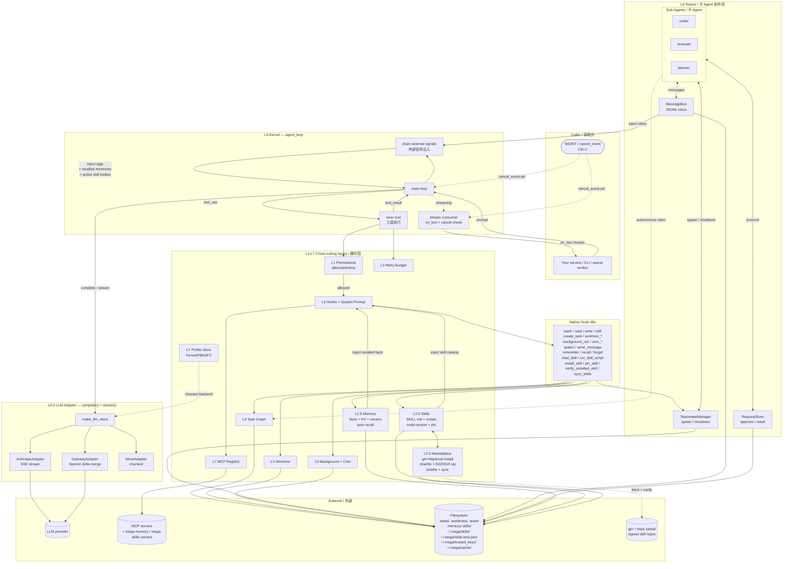

# mega_agent

> Production-grade Agent runtime kernel — bring your own LLM key, tools, and business logic.
> 工业级 Agent 运行时内核 —— 自带 LLM Key、自带工具、自带业务逻辑,即插即用。

[](https://www.python.org/)
[](LICENSE)
[](mega_agent/__init__.py)


---

## 🌍 Overview / 概览

**EN —** `mega_agent` is a **layered, replaceable, batteries-included** Python package that turns an LLM into a real agent: tool calling, permission gating, error self-healing, task isolation, scheduling, encrypted credentials, and MCP plugin support — all in 13 small modules you can read in an afternoon. It is **not** another wrapper that ties you to one vendor. It is a kernel: pick your LLM, register your tools, embed it into your service.

**中文 —** `mega_agent` 是一个**分层、可替换、开箱即用**的 Python 包,把任意 LLM 变成可执行的 Agent:工具调用、权限管控、错误自愈、任务隔离、调度、加密凭据、MCP 插件 —— 全部装进 13 个一下午就能读完的小模块里。它**不是**又一个把你绑死在某厂商的封装层,而是一个**内核**:挑你的 LLM,注册你的工具,嵌进你的服务。

---

## ✨ Highlights / 核心亮点

| EN | 中文 |
|---|---|
| **Drop-in embed** — `from mega_agent import agent_loop`, three lines and you're running. | **三行嵌入** —— `from mega_agent import agent_loop`,三行代码就能跑起来。 |
| **Vendor-neutral** — `anthropic` SDK, any OpenAI-compatible gateway (OpenAI / LiteLLM / OpenRouter / vLLM / your own), or a deterministic `mock` backend for tests. | **厂商中立** —— 原生 `anthropic`,任意 OpenAI 兼容网关(OpenAI / LiteLLM / OpenRouter / vLLM / 自建),或确定性 `mock` 后端供测试。 |
| **29 native tools** — file IO, shell, task graph, git worktree, background runner, cron, multi-agent inbox. | **29 个内置工具** —— 文件读写、Shell、任务图、git worktree、后台执行器、Cron、多 Agent 收件箱。 |
| **Encrypted profile store** — Fernet + PBKDF2-HMAC-SHA256 (200,000 iterations); zero-config plaintext fallback for dev. | **加密 Profile 仓库** —— Fernet + PBKDF2-HMAC-SHA256(20 万轮);零配置时降级为明文供本地调试。 |
| **Semantic routing** — `@code` → Claude, `@write` → GPT-4o, default → in-house gateway. | **语义路由** —— `@code` 走 Claude,`@write` 走 GPT-4o,默认走自建网关。 |
| **Three-state permission gate** — `allow / ask / deny`, classified by tool name and command shape. | **三态权限闸** —— `allow / ask / deny`,根据工具名与命令形态自动分级。 |
| **Errors are observations** — failed tool calls become `is_error=True` results so the LLM can choose another path, not crash. | **错误即观察** —— 工具调用失败转化为 `is_error=True` 的结果让 LLM 重新决策,而不是把 loop 炸掉。 |
| **Retry budget** — tools that fail N times in a row are auto-disabled and the LLM is told. | **重试预算** —— 连续失败 N 次的工具自动禁用并通知 LLM。 |
| **MCP support** — connect any MCP server with one line: `mcp.register("server", ["cmd"])`. | **MCP 插件** —— 一行接入任意 MCP server:`mcp.register("server", ["cmd"])`。 |
| **Cross-session memory** — append-only facts log + KV preferences + pluggable vector backend (`naive` BM25-ish / `chroma` / `mock`); auto-recall injects relevant memories into the system prompt. | **跨会话记忆** —— 只追加事实日志 + KV 偏好 + 可插拔向量后端(`naive` BM25 / `chroma` / `mock`);自动召回相关记忆注入系统提示词。 |
| **Skills + signed marketplace** — Anthropic-compatible SKILL.md bundles, on-demand load, multi-version + pin, atomic install from `git+`/https/local with sha256 + Ed25519 signature checks. | **Skill + 签名市场** —— 兼容 Anthropic SKILL.md,按需加载,多版本+pin,从 `git+`/https/本地原子安装,带 sha256 + Ed25519 签名校验。 |
| **Streaming + Ctrl-C cancel** — every adapter exposes `.stream()`; the kernel honours a `cancel_event` flag and unwinds cleanly without breaking the tool_use ↔ tool_result contract. | **流式输出 + Ctrl-C 中断** —— 每个 adapter 都实现 `.stream()`;内核遵守 `cancel_event` 标志,优雅退出且不破坏 tool_use ↔ tool_result 契约。 |
| **Observability + loop guard** — JSONL event bus (`events.jsonl`), `before/after/error` hook chain ready for OpenTelemetry GenAI semconv, plus a drop-in repeat-call detector that turns oscillation into a recoverable `tool_result`. | **可观测 + 防循环** —— JSONL 事件总线 `events.jsonl`、`before/after/error` 钩子链可直接对接 OpenTelemetry GenAI 语义,内置可插拔重复调用检测器,把震荡转成可恢复的 `tool_result`。 |

---

## 🏗 Architecture / 架构

**EN —** Every prompt enters the kernel; the kernel asks an `LLMClient` for the next action (via `complete()` or, when streaming, `stream()` with a `cancel_event`), dispatches any `tool_use` block through the permission gate and hook chain into either a native handler or an MCP server, captures the result (success *or* error) as a `tool_result`, then loops until the LLM emits `end_turn`.

**中文 —** 每条 prompt 进入内核;内核向 `LLMClient` 索取下一步动作(走 `complete()`,或开启流式时走 `stream()` + `cancel_event`),把 `tool_use` 块经权限闸 + 钩子链派发到原生 handler 或 MCP server,把结果(成功或失败)封装成 `tool_result` 回灌,如此循环直到 LLM 输出 `end_turn`。



### Module map / 模块地图

| File | Layer | EN Responsibility | 中文职责 |
|---|---|---|---|
| `config.py` | — | Path layout + env vars + git root detection | 路径布局 + 环境变量 + git 根目录探测 |
| `events.py` | — | Append-only JSONL event bus | 仅追加 JSONL 事件总线 |
| `permissions.py` | L1 | Capability gate, three-state decision | 能力闸,三态决策 |
| `hooks.py` | L2 | Synchronous hook bus + system prompt (auto-injects recalled memories + skill catalog) | 同步钩子 + 系统提示词(自动注入召回记忆 + skill 目录) |
| `memory.py` | L2.5 | Cross-session memory: facts log + KV prefs + pluggable vector backend (`naive`/`chroma`/`mock`) + GDPR forget_user | 跨会话记忆:事实日志 + KV 偏好 + 可插拔向量后端 + GDPR 注销 |
| `skills.py` | L2.5 | SKILL.md discovery, multi-version + SemVer pin, on-demand load, `run_skill_script` with path-traversal guard | SKILL.md 发现、多版本 + SemVer pin、按需加载、带路径穿越防护的脚本执行 |
| `skill_market.py` | L2.5 | 7-stage install pipeline (parse → policy → fetch → verify → resolve → commit → activate); sha256 + Ed25519 sig; lockfile + `sync` reproducibility | 7 段安装流水线;sha256 + Ed25519 验签;锁文件 + `sync` 可复现 |
| `retry.py` | L3 | Per-tool failure budget with auto-disable | 按工具粒度的失败预算与自动禁用 |
| `tasks.py` | L4 | DAG task store (one JSON file per task) | DAG 任务仓库(每任务一个 JSON 文件) |
| `worktree.py` | L4 | Git-worktree wrapper with task binding | git-worktree 封装,与任务绑定 |
| `background.py` | L5 | Background subprocess runner + priority queue + cron | 后台子进程执行器 + 优先队列 + Cron |
| `teams.py` | L6 | Multi-agent inbox + protocol request ledger | 多 Agent 收件箱 + 协议请求账本 |
| `mcp.py` | L7 | Stdio + JSON-RPC 2.0 MCP client/registry | Stdio + JSON-RPC 2.0 MCP 客户端/注册表 |
| `profiles.py` | L7 | Encrypted profile store + routing table | 加密 Profile 仓库 + 路由表 |
| `llm/` | L0.5 | LLMClient protocol with `complete()` + `stream()` (SSE/delta-merge/chunked) + 3 adapters + factory | LLMClient 协议(`complete()` + `stream()`)+ 3 个适配器 + 工厂 |
| `tools.py` | — | 48 native tool handlers + schema builder (29 base + 7 memory + 5 skills + 7 marketplace) | 48 原生工具(29 基础 + 7 记忆 + 5 skill + 7 市场)+ Schema 构造器 |
| `kernel.py` | L0 | The agent loop · supports `on_text` streaming + `cancel_event` clean unwind | Agent 主循环 · 支持 `on_text` 流式 + `cancel_event` 优雅退出 |
| `cli.py` | — | Reference REPL · `/skills` `/install` `/pin` `/verify` `/sync` `/stream` + SIGINT handler | 参考 REPL · `/skills` `/install` `/pin` `/verify` `/sync` `/stream` + SIGINT 处理 |
| `mcp_servers/mega_memory_server.py` | — | Standalone MCP server exposing the memory store (7 tools) | 独立 MCP server,暴露记忆存储(7 工具) |
| `mcp_servers/mega_skills_server.py` | — | Standalone MCP server exposing skills + marketplace (12 tools) | 独立 MCP server,暴露 skill + 市场(12 工具) |
| `mega-skills/` | — | Push-ready signed skill catalogue (csv-analyst, log-summarizer) + Ed25519 keygen / sign tools | 即推即用的签名 skill 仓库 + Ed25519 keygen / 签名工具 |

---

## 📦 Install / 安装

```bash
git clone https://github.com/wangxfholly/agent_basic.git
cd agent_basic
pip install -r requirements.txt
```

Requirements (Python 3.10+) / 依赖(需 Python 3.10+):

| Package | Required when / 何时需要 |
|---|---|
| `anthropic` | Using the `anthropic` protocol / 使用 anthropic 协议时 |
| `openai` | Using the `openai` protocol (covers ANY OpenAI-compatible gateway) / 使用 openai 协议时(覆盖一切 OpenAI 兼容网关) |
| `cryptography` | `AGENT_MASTER_PASSWORD` is set (encrypted profile store) / 设置了 `AGENT_MASTER_PASSWORD`(开启加密 Profile)时 |

Install only what you need; the others stay as soft imports. / 按需安装,其他保持软导入。

---

## 🚀 Quick start / 快速开始

### Option A — REPL 交互模式

```bash
export ANTHROPIC_API_KEY=sk-ant-xxxxx
python -m mega_agent
```

```
== mega_agent ==
WORKDIR   = /your/cwd
tools     = 29 native + 0 mcp
secrets   = DISABLED (plaintext)
profile   = (none — use /add-profile or env)
you> list files in this dir and tell me how many
```

### Option B — Embed in your service / 嵌入你的服务

```python
from mega_agent import agent_loop

def handle_request(prompt: str) -> str:
    msgs = agent_loop(prompt)
    last = msgs[-1]["content"]
    return "\n".join(
        b.text for b in last
        if getattr(b, "type", None) == "text"
    )
```

**EN —** That's it. `agent_loop` is thread-safe; state persists in `.tasks/`, `.worktrees/`, etc. under `AGENT_WORKDIR`.

**中文 —** 就这么多。`agent_loop` 线程安全,状态持久化在 `AGENT_WORKDIR` 下的 `.tasks/`、`.worktrees/` 等目录。

### Examples / 示例

| File | EN Demonstrates | 中文说明 |
|---|---|---|
| [`01_quickstart.py`](examples/01_quickstart.py) | Minimal embed | 最小化嵌入 |
| [`02_custom_tool.py`](examples/02_custom_tool.py) | Register your own business tools | 注册自有业务工具 |
| [`03_hooks.py`](examples/03_hooks.py) | Audit / metering / compliance via hooks | 通过钩子做审计 / 计量 / 合规 |
| [`04_routing.py`](examples/04_routing.py) | Multi-profile + semantic routing programmatically | 编程方式配置多 Profile + 语义路由 |
| [`05_mock_test.py`](examples/05_mock_test.py) | Deterministic unit tests with `MockAdapter` | 用 `MockAdapter` 写确定性单测 |

---

## 🔑 Configuring LLM backends / LLM 后端配置

### Single key, single model (env-only) / 单 Key 单模型(纯环境变量)

```bash
export ANTHROPIC_API_KEY=sk-ant-xxx
# 或任意 OpenAI 兼容网关 / or any OpenAI-compatible gateway:
export AGENT_LLM_BACKEND=gateway
export AGENT_GATEWAY_BASE_URL=https://api.openai.com/v1
export AGENT_GATEWAY_API_KEY=sk-xxx
export AGENT_MODEL=gpt-4o
```

### Multiple keys + routing (recommended for prod) / 多 Key + 路由(生产推荐)

```bash
export AGENT_MASTER_PASSWORD='choose a strong passphrase'
python -m mega_agent
```

In the REPL / REPL 内:

```
you> /add-profile
  name      : claude
  protocol  : anthropic
  model     : claude-sonnet-4-20250514
  api_key   : sk-ant-xxx

you> /add-profile
  name      : gpt4o
  protocol  : openai
  base_url  : https://api.openai.com/v1
  api_key   : sk-xxx
  model     : gpt-4o

you> /route code claude
you> /route write gpt4o
you> /route default claude

you> @code   write me a binary search in Python
you> @write  rewrite the comments above in plain English
you> a generic question goes through the default route
```

**EN —** Profiles are persisted to `models.json.enc` (Fernet ciphertext) when `AGENT_MASTER_PASSWORD` is set, otherwise to `models.json` (plaintext, with a one-time warning).

**中文 —** 设置了 `AGENT_MASTER_PASSWORD` 时 Profile 落盘为 `models.json.enc`(Fernet 密文),否则落盘为 `models.json`(明文,首次会有警告)。

---

## 🔧 Adding your own tools / 注册自定义工具

Three lines / 三行搞定:

```python
from mega_agent import TOOL_HANDLERS, agent_loop

def query_user(inp: dict) -> dict:
    return my_db.fetch_user(inp["user_id"])

TOOL_HANDLERS["query_user"] = query_user

agent_loop("Look up user u123 and summarise their recent activity.")
```

**EN —** The kernel picks up the new handler the next time `build_tool_schemas()` runs (which is once per `agent_loop` call). The LLM sees `query_user` automatically. For a richer schema, see the inline notes in [`mega_agent/tools.py`](mega_agent/tools.py).

**中文 —** 内核会在下次 `build_tool_schemas()` 时自动拾取新 handler(每次 `agent_loop` 调用前会跑一次),LLM 自动看到 `query_user`。需要更详尽 schema 见 [`mega_agent/tools.py`](mega_agent/tools.py) 内注释。

---

## 🪝 Cross-cutting via hooks / 用钩子做横切

**EN —** Hooks run synchronously in the calling thread; ideal for audit logs, metering, rate limits, and PII scrubs.

**中文 —** 钩子在调用线程内同步执行;适合审计日志、计量、限流、PII 脱敏。

| Event | Payload |
|---|---|
| `tool.before` | `{name, input, intent}` |
| `tool.after` | `{name, intent, ok}` |
| `tool.error` | `{name, intent, error}` |
| `loop.iter` | `{iter, backend}` |

```python
from mega_agent import hooks

def audit(payload):
    log.info("tool=%s risk=%s", payload["name"], payload["intent"]["risk"])

hooks.on("tool.before", audit)
```

Full demo: [`examples/03_hooks.py`](examples/03_hooks.py). / 完整示例见 [`examples/03_hooks.py`](examples/03_hooks.py)。

---

## 🛡 Permission model / 权限模型

The gate classifies every call / 闸对每次调用进行分级:

| Risk / 风险 | Trigger / 触发条件 | `auto` mode | `strict` mode |
|---|---|---|---|
| `read` | Tool name starts with `read/list/get/show/search/query/inspect` | **allow** | **allow** |
| `write` | Anything else not flagged below / 其他未命中下方规则的 | **allow** | **ask** |
| `high` | Tool starts with `delete/remove/drop/rm/kill/shutdown`, or bash contains `rm -rf` / `shutdown` / `mkfs` / `dd if=` | **ask** | **ask** |

**EN —** `ask` in non-interactive runs auto-denies. Wrap `kernel._exec_tool` or extend `cli.py` to plug in your own UI prompt and call `permissions.remember(name, "allow")` to whitelist.

**中文 —** 非交互场景下 `ask` 默认拒绝。可以包装 `kernel._exec_tool` 或扩展 `cli.py` 接入你自己的 UI 询问,然后调用 `permissions.remember(name, "allow")` 加白。

```python
from mega_agent import permissions
permissions.allowlist.add("query_user")        # always allow / 永远放行
permissions.denylist.add("shutdown_teammate")  # never run / 永远禁止
permissions.mode = "strict"                    # globally tighter / 全局收紧
```

---

## 🛟 Reliability features / 可靠性特性

### Errors are observations / 错误即观察

**EN —** A tool that raises is *not* propagated out of `agent_loop`. The kernel converts the exception into:

**中文 —** 工具抛错**不会**穿出 `agent_loop`。内核会把异常转成:

```json
{"type": "tool_result", "is_error": true, "content": "ERROR: <msg>"}
```

**EN —** The LLM reads it on the next turn and decides whether to retry, change strategy, or surface the failure to the user.

**中文 —** LLM 在下一轮读到后,自行决定重试、换策略,还是把失败回报给用户。

### Retry budget / 重试预算

**EN —** Each tool tracks its consecutive-failure count. After `AGENT_RETRY_THRESHOLD` (default 3) failures it is **disabled**, and the next user turn carries:

**中文 —** 每个工具记录自己的**连续失败计数**。超过 `AGENT_RETRY_THRESHOLD`(默认 3 次)后被**禁用**,下一轮用户消息会被注入:

```
<retry-budget>tools temporarily disabled: bash,query_user</retry-budget>
```

```bash
export AGENT_RETRY_THRESHOLD=5
```

### Worktree isolation / 工作树隔离

**EN —** Spawn parallel subtasks without races. / **中文 —** 并发子任务零竞态:

```
you> create_task title="implement A"   → t1
you> create_worktree name=feat-a task_id=t1
you> run_in_worktree feat-a "pytest"
you> worktree_closeout feat-a action=remove complete_task=true
```

**EN —** Each worktree is a real `git worktree add`, on its own branch (`wt/<name>`). Multiple subagents can edit files in isolation; `worktree_closeout` either keeps or removes the branch and updates the bound task.

**中文 —** 每个 worktree 都是真实的 `git worktree add`,独立分支(`wt/<name>`)。多个子 Agent 可以在文件层面互不干扰;`worktree_closeout` 可选保留或删除分支,并同步更新绑定任务。

---

## 🔭 Observability & loop guard / 可观测与防循环

**EN —** Traditional service monitoring (RED / USE) only catches "the box is down". An LLM agent can also go *insane* — hallucinate, oscillate between two tools, or burn $$$ in a context-stuffing loop while every HTTP code stays 200. mega_agent ships first-class hooks for the four signals that classical APMs miss: **iter depth, token cost, tool-error topology, and stop-reason mix**.

**中文 —** 传统 RED/USE 监控只能告诉你"机器坏没坏",但 Agent 还会"疯掉" —— 幻觉、两个工具反复互调、上下文塞爆烧钱,而 HTTP 码全程 200。mega_agent 内置了经典 APM 抓不到的四个信号:**迭代深度、Token 成本、工具错误拓扑、stop_reason 分布**。

### Built-in telemetry surface / 内置遥测面

| Signal / 信号 | Where it comes from / 来源 | What to do with it / 怎么用 |
|---|---|---|
| `events.jsonl` append-only bus | `mega_agent.events.EventBus` — every kernel/tool/permission/hook event lands here with `{id, ts, kind, …}` | tail / `jq` / ship to Loki / ClickHouse |
| `hooks.before / after / error` chain | `mega_agent.hooks.HookBus` emits `tool.before`, `tool.after`, `tool.error`, `loop.iter` from the kernel — wrap any tool call with metrics, tracing, redaction | one-line OTel exporter, zero kernel changes |
| Retry budget telemetry | `retry.py` records consecutive-failure counts per tool | alert on `tool_disabled` events |
| Stop-reason stream | every `agent_loop` exit writes `kind=loop.iter` (per turn) and a final response with `stop_reason` | dashboard the `end_turn / max_iter / cancelled / error` mix |
| LLM usage | adapters surface `usage.input_tokens` / `usage.output_tokens` in each `LLMResponse` | feed `$/turn` and context-pressure gauges |
| Cancellation | `cancel_event` flips → kernel emits `[cancelled by user]` and synthesizes `tool_result: CANCELLED by user` for in-flight `tool_use` blocks | proves the contract held; useful in load tests |

> Default location: `${AGENT_WORKDIR}/events.jsonl` (override via `AGENT_EVENTS_LOG`). Rotate with `logrotate` or pipe through `vector` / OTel Collector.

### Loop guard / 防循环三件套

LLM agents loop for 4 textbook reasons — **A↔B oscillation, same-args retry, context bloat, goal drift**. mega_agent ships three layered defences:

1. **Hard cap** — `AGENT_MAX_ITERS` (default 50) terminates with a `max_iter` exit reason.
2. **Retry budget** — same-tool consecutive failures auto-disable that tool and tell the LLM (see [Retry budget](#retry-budget--重试预算)).
3. **Repeat-call detector (opt-in hook)** — register a handler on `tool.before` to spot oscillation and same-args replay, then emit a `loop.detected` event for your monitor / alarm to act on:

```python
import hashlib, json, collections
from mega_agent.hooks import hooks
from mega_agent.events import events

_recent = collections.deque(maxlen=8)

def _loop_guard(payload):
    name  = payload.get("name")
    args  = payload.get("input") or {}
    sig   = hashlib.md5(f"{name}:{json.dumps(args, sort_keys=True)}".encode()).hexdigest()[:10]
    _recent.append(sig)
    if _recent.count(sig) >= 3:                  # same call ≥3× in last 8 steps
        events.emit("loop.detected", tool=name, sig=sig)

hooks.on("tool.before", _loop_guard)
```

> Hook handlers are advisory (exceptions get caught and logged as `hook.failed`).
> For *enforcement*, drive cancellation from outside: when your monitor sees a
> `loop.detected` burst, flip the `cancel_event` you passed into `agent_loop`
> — the kernel will unwind cleanly and keep the tool_use ↔ tool_result
> contract intact.

### Wiring to OpenTelemetry / 接入 OpenTelemetry

`hooks.py` is the single integration point — no kernel patch needed. Minimal exporter:

```python
from opentelemetry import trace, metrics
from mega_agent.hooks import hooks

tracer = trace.get_tracer("mega_agent")
meter  = metrics.get_meter("mega_agent")
m_tool = meter.create_counter  ("agent.tool.calls")
m_terr = meter.create_counter  ("agent.tool.errors")
m_iter = meter.create_histogram("agent.iter.depth")

_spans = {}

def _pre(p):
    name = p.get("name")
    _spans[name] = tracer.start_span(f"tool.{name}")
    m_tool.add(1, {"tool": name})

def _post(p):
    sp = _spans.pop(p.get("name"), None)
    if sp: sp.end()

def _err(p):
    name = p.get("name")
    m_terr.add(1, {"tool": name})
    sp = _spans.pop(name, None)
    if sp:
        sp.set_attribute("error", str(p.get("error", ""))[:200]); sp.end()

def _iter(p):
    m_iter.record(p.get("iter", 0), {"backend": p.get("backend", "unknown")})

hooks.on("tool.before", _pre)
hooks.on("tool.after",  _post)
hooks.on("tool.error",  _err)
hooks.on("loop.iter",   _iter)
```

> Token & cost gauges live in your LLM adapter — wrap `complete()` / `stream()` to emit `gen_ai.usage.input_tokens` / `gen_ai.usage.output_tokens` per the **OpenTelemetry GenAI semconv** so any LLM-aware backend (Langfuse, Phoenix, Helicone, Argos) lights up the panels for free.

### What to dashboard / 必建的 6 个面板

| Panel / 面板 | Key metric / 核心指标 | Why it matters / 价值 |
|---|---|---|
| Realtime health | `turns/min`, `P95 turn latency`, `error rate`, `$/min` | NOC at-a-glance |
| Loop watch | `max_iter` rate, top `(tool, args_hash)`, `loop.detected` count | catches insanity before billing does |
| Token & cost | `tokens_per_turn` per model, `$/task`, daily burn vs budget | the only metric your CFO reads |
| Tool topology | per-tool QPS / err-rate / P99 / disabled count | which tool is the weakest link |
| Stop-reason mix | stacked area of `end_turn / tool_use / max_tokens / max_iter / cancelled / error` | shape changes show regressions earliest |
| Eval trend | golden-set pass-rate + online LLM-judge sample score | catches *silent* quality regressions deploys can hide |

> See [docs/observability.md](docs/observability.md) for a full Grafana JSON + alert rules pack (tracked separately to keep the README skim-friendly).

---

## 👥 Multi-agent / 子 Agent 协作

**EN —** Built-in lead-and-teammates pattern. The lead (your `agent_loop` caller) spawns sub-agents on background threads; each has its own role, JSONL inbox, and optional autonomous task-claiming behaviour.

**中文 —** 内置主-从多 Agent 协作模式。主 Agent(你的 `agent_loop` 调用方)在后台线程拉起子 Agent;每个子 Agent 有自己的角色、JSONL 收件箱,可选自主任务认领能力。

### Tools / 工具

| Tool | EN | 中文 |
|---|---|---|
| `spawn` | Start a teammate by name + role (+ `autonomous` flag) | 按 name + role 启动一个子 Agent(可选 `autonomous`) |
| `list_teammates` | List all teammates and their status | 列出所有子 Agent 及其状态 |
| `send_message` | Send a typed message to a teammate's inbox | 投递一条带类型的消息到指定收件箱 |
| `read_my_inbox` | Drain the caller's inbox (destructive read) | 拉取并清空自己的收件箱 |
| `shutdown_teammate` | Stop a teammate gracefully | 优雅关闭某个子 Agent |

### Message types / 消息类型

`chat` · `result` · `shutdown_request` · `shutdown_response` · `plan_approval` · `plan_approval_response`

**EN —** Unknown types are rejected at the bus to prevent protocol drift. Inbox messages addressed to the lead are auto-injected into the next user turn as `<inbox>...</inbox>` tags — same single input surface as background results and retry-budget alerts.

**中文 —** 未知类型在总线层直接拒收,防止协议漂移。投给主 Agent 的收件箱消息会以 `<inbox>...</inbox>` 标签自动注入下一轮用户消息 —— 与后台结果、重试预算告警共用同一个输入面。

### Pattern / 典型用法

```
spawn name=coder    role=implement  autonomous=true
spawn name=reviewer role=review     autonomous=true

create_task title="implement search"           → t1
create_task title="review t1" deps=[t1]        → t2

# autonomous teammates claim matching tasks themselves
# coder picks t1 → works in worktree wt/feat-search
# reviewer waits for t1 done → claims t2

send_message to=coder type=chat body={"hint":"use prefix tree"}
read_my_inbox who=lead   # drain replies
```

### Cross-agent protocol / 跨 Agent 协议

**EN —** `RequestStore` (`.requests/<rid>.json`) tracks open requests with state machine `open → approved/rejected → done`. Use it for plan approvals, async results, or any request that needs a durable handshake.

**中文 —** `RequestStore`(`.requests/<rid>.json`)维护持久化请求账本,状态机 `open → approved/rejected → done`。适合方案审批、异步结果回执等需要可恢复握手的场景。

---

## 🔌 MCP plugins / MCP 插件

```python
from mega_agent import mcp
mcp.register("filesystem", ["mcp-server-filesystem", "/path/to/root"])
mcp.register("github",     ["mcp-server-github"])
```

**EN —** All registered tools appear automatically in `build_tool_schemas()` under names `mcp__<server>__<tool>`. The permission gate treats them like native tools (their risk is inferred from the name prefix).

**中文 —** 所有注册的工具会自动出现在 `build_tool_schemas()` 中,命名为 `mcp__<server>__<tool>`。权限闸对它们的处理与原生工具完全一致(基于名称前缀推导风险)。

---

## 🧠 Memory / 记忆

**EN —** mega_agent ships a layered memory module so agents can carry knowledge **across turns and across processes** without any external service.

**中文 —** mega_agent 自带分层记忆模块,Agent 无需依赖外部服务即可在 **对话之间、进程之间** 沉淀知识。

| Layer / 层 | Backed by / 存储 | EN | 中文 |
|---|---|---|---|
| **Project memory** | `CLAUDE.md` | Static rules / facts injected into every system prompt | 静态规则/事实,注入每次系统提示词 |
| **Episodic** | `.memory/facts.jsonl` | Append-only log of `remember()` calls (timestamped) | `remember()` 的追加式日志(带时间戳) |
| **Semantic KV** | `.memory/kv.json` | Single-value preferences via `set_pref / get_pref` | 单值偏好,通过 `set_pref / get_pref` |
| **Vector recall** | `.memory/vectors/` | Pluggable backend: `naive` (default) \| `chroma` \| `mock` | 可插拔向量后端 |

### Native tools / 原生工具

```python
from mega_agent import memory

memory.remember("user prefers dark mode", kind="preference",
                user_id="alice", topic="ui")
memory.recall("what theme does the user like?", k=3)
memory.set("alice.lang", "zh-CN")
memory.get("alice.lang")
memory.forget("<fact_id>")
memory.forget_user("alice")     # GDPR-style purge
```

The kernel auto-injects the top-k recalled facts into the system prompt every turn (controlled by `agent_loop(..., recall_k=5)`).

内核每一轮会把当前用户输入的 top-k 相关记忆自动注入 system prompt(由 `agent_loop(..., recall_k=5)` 控制)。

### Vector backends / 向量后端

```bash
# Default — pure-stdlib BM25-ish lexical scorer, zero deps.
AGENT_MEMORY_BACKEND=naive

# Production — persistent vector DB (pip install chromadb).
AGENT_MEMORY_BACKEND=chroma

# Tests — deterministic mock that records all calls.
AGENT_MEMORY_BACKEND=mock
```

Implement your own by satisfying the `VectorBackend` Protocol (`index / search / delete`).

实现自定义后端只需满足 `VectorBackend` Protocol 三个方法 (`index / search / delete`)。

### Standalone MCP server / 独立 MCP Server

**EN —** The same `MemoryStore` is also exposed as a **standalone MCP server** (`mcp_servers/mega_memory_server.py`) so any MCP-compatible host (Claude Desktop, Cursor, your own kernel) can attach to one persistent memory pool.

**中文 —** 同一份 `MemoryStore` 还以 **独立 MCP Server** 形式暴露(`mcp_servers/mega_memory_server.py`),任何兼容 MCP 的宿主(Claude Desktop、Cursor、自研内核)都能挂接到同一份持久化记忆池。

```python
from mega_agent import mcp
mcp.register("memory", ["python", "-m", "mcp_servers.mega_memory_server"])
# tools surface as: mcp__memory__remember / mcp__memory__recall / ...
```

Or wire it into Claude Desktop's `claude_desktop_config.json`:

```json
{
  "mcpServers": {
    "mega-memory": {
      "command": "python",
      "args": ["-m", "mcp_servers.mega_memory_server"]
    }
  }
}
```

Runnable demo: [`examples/06_memory.py`](examples/06_memory.py).

---

## 🎒 Skills / 技能包

**EN —** Skills are on-demand capability bundles that follow the Claude Code / Anthropic Skills file layout. Each skill is a directory with `SKILL.md` (YAML frontmatter + markdown body) plus optional `scripts/` and `resources/`. The kernel injects only a one-line catalog into every system prompt; the LLM activates a skill via `load_skill(name)` when relevant — keeping token cost flat as the library grows.

**中文 —** Skills 是按需加载的能力包,文件布局对齐 Claude Code / Anthropic Skills:每个 skill 是一个目录,含 `SKILL.md`(YAML frontmatter + markdown 正文)以及可选的 `scripts/` 和 `resources/`。内核只把一行目录注入 system prompt,LLM 在需要时通过 `load_skill(name)` 激活 —— 哪怕 skill 越来越多,token 开销也保持平稳。

### File layout / 文件布局

```
skills/
  csv-analyst/
    SKILL.md           # required — frontmatter + body
    scripts/
      profile.py       # invoked via run_skill_script
    resources/         # optional templates / data
```

`SKILL.md` frontmatter:

```yaml
---
name: csv-analyst
description: Profile a CSV file using stdlib only.
allowed_tools:        # optional — auto-allowlisted on load
  - bash
  - read_file
auto_load: false      # optional — eager body injection
---
```

### Native tools / 原生工具

| Tool | EN | 中文 |
|---|---|---|
| `list_skills` | List discoverable skills | 列出可发现的 skill |
| `load_skill(name)` | Activate a skill — body sticks in subsequent system prompts | 激活 skill,正文从下一轮起注入 |
| `unload_skill(name)` | Deactivate a previously loaded skill | 卸载已激活的 skill |
| `run_skill_script(name, script, args)` | Execute a script under `<skill>/scripts/` (path-traversal blocked) | 执行 skill 自带脚本(防路径穿越) |
| `refresh_skills` | Re-scan the search dirs | 重新扫描搜索目录 |

### Search path / 搜索路径

1. `<WORKDIR>/skills/` — project-local
2. `~/.mega/skills/` — user-level

First match wins; later dirs do not override earlier names.

第一个命中为准,后面的目录不会覆盖前面的同名 skill。

### Standalone MCP server / 独立 MCP Server

Same dual-form pattern as memory: `mcp_servers/mega_skills_server.py` exposes the registry over JSON-RPC 2.0 / stdio, so any MCP host (Claude Desktop, Cursor, your own kernel) can attach to one shared skill library.

与 memory 一致的"内嵌 + 独立"双形态:`mcp_servers/mega_skills_server.py` 通过 JSON-RPC 2.0 / stdio 暴露 registry,任何 MCP host 都能挂接同一份 skill 库。

```python
from mega_agent import mcp
mcp.register("skills",
             ["python", "-m", "mcp_servers.mega_skills_server"])
# tools surface as: mcp__skills__list_skills / mcp__skills__load_skill / ...
```

Runnable demo: [`examples/07_skills.py`](examples/07_skills.py).
Bundled example skill: [`skills/csv-analyst/`](skills/csv-analyst/).

### Marketplace · install / remove / pin / sync / 市场安装

**EN —** mega has a built-in skill marketplace that ships with the runtime — no central registry required, like `go install`. You install from a git repo, an http(s) tarball, or a local directory. Every install is a 7-stage pipeline that **never executes skill code at install time** (supply-chain red line).

**中文 —** mega 自带 skill 市场,不依赖中心服务,类似 `go install`。来源支持 git 仓库、http(s) tarball、本地目录。每次安装走 7 步流水线,**安装阶段绝不执行 skill 自带的脚本**(供应链红线)。

```
PARSE → POLICY → FETCH → VERIFY → RESOLVE → COMMIT → ACTIVATE
   ↑       ↑        ↑        ↑          ↑         ↑          ↑
 source  hosts   tmp dir  SKILL.md   target    atomic    refresh
 + sha   allow-  (no exec) name re   <name>@   rename +  registry
        list              + sig +    <ver>     lockfile
                          sha256
```

#### Sources / 安装来源

```python
from mega_agent import install_skill

# Git (shallow clone --depth=1, .git stripped after fetch)
install_skill("git+https://github.com/foo/csv-analyst.git@v0.4.0")

# HTTP(S) tarball or zip — sha256 is mandatory unless insecure=True
install_skill(
    "https://example.com/skills/log-summarizer.tar.gz",
    sha256="9f8e7d6c5b4a...",
)

# Local directory (development workflow)
install_skill("./skills-staging/my-skill")
```

#### Storage layout / 存储布局

```
~/.mega/
├── skills/<name>@<version>/        # 一个版本一个目录,可并存
│   ├── SKILL.md
│   ├── scripts/
│   └── .install.json               # 安装元数据
├── skills.lock.json                # 全局锁文件(单一事实源)
├── skills.toml                     # 策略:allowed_hosts / require_signature
├── trusted_keys/*.pub              # Ed25519 公钥白名单
└── cache/<sha256>                  # tarball 下载缓存,加速重装
```

`SkillRegistry` already searches `~/.mega/skills/`,所以装完调一次 `skills.refresh()` 就出现在 catalog,**完全零侵入**。

#### Multi-version + pin / 多版本与版本锁

```python
from mega_agent import skills

skills.all_versions("csv-analyst")     # ['0.4.0', '0.3.1']
# default: highest SemVer
skills.pin("csv-analyst", "0.3.1")     # rollback to old
skills.pin("csv-analyst", None)        # unpin
```

#### Native tools / 原生工具

| Tool | EN | 中文 |
|---|---|---|
| `install_skill(source, sha256?, force?, insecure?, allow_unsigned?)` | Run the install pipeline | 跑安装流水线 |
| `remove_skill(name, version?)` | Remove one (or all) versions | 删除某版本(不传则全删) |
| `list_installed_skills` | Return the lockfile | 返回锁文件 |
| `verify_installed_skill(name?)` | Re-hash on disk vs lockfile | 重算文件 hash 与锁文件比对 |
| `sync_skills` | Reproduce installs from lockfile | 按锁文件重建一台机 |
| `pin_skill(name, version?)` | Pin / unpin a version | 锁定/解锁版本 |
| `skill_versions(name)` | List installed versions | 列出已装版本 |

#### Security model / 安全模型

| Layer / 层 | EN | 中文 |
|---|---|---|
| Host allowlist | `skills.toml` `allowed_hosts = [...]`; empty = unrestricted | 域名白名单,空数组等于不限 |
| sha256 | Required for http sources unless `insecure=True` | http 源强制 sha256(`insecure=True` 才放行) |
| Ed25519 signature | Optional `SKILL.md.sig` verified against `trusted_keys/*.pub` (PEM) | 可选 Ed25519 签名,与 `trusted_keys/*.pub` 比对 |
| `require_signature` | Set true to reject unsigned skills outright | 置 true 直接拒装未签名 skill |
| **No install hooks** | Install never runs `subprocess` on skill content | 安装阶段绝不执行 skill 内任何脚本 |

#### Reproducibility / 可复现

```python
from mega_agent import sync_skills, list_installed_skills

list_installed_skills()  # → {"version": 1, "skills": {...}}
# Ship skills.lock.json to a fresh machine, then:
sync_skills()            # walks the lockfile, reinstalls each entry
```

Runnable demo: [`examples/08_skill_market.py`](examples/08_skill_market.py).

#### Demo signed skill repo / 示范签名 skill 仓库

A push-ready, signed catalogue lives in [`./mega-skills/`](./mega-skills/)
and is mirrored at
[github.com/wangxfholly/mega-skills](https://github.com/wangxfholly/mega-skills):

```
mega-skills/
  skills/
    csv-analyst/      ← profile any CSV
    log-summarizer/   ← bucket a log into severity + top error templates
  keys/
    dev_signing_key.pub   ← ship me to consumers
    dev_signing_key.pem   ← .gitignore'd; sign with me
  tools/
    gen_signing_key.py    ← Ed25519 keygen
    sign_skills.py        ← (re)sign every SKILL.md
```

**Consumer workflow:**

```python
import pathlib, shutil, urllib.request
from mega_agent import install_skill

# 1. trust the publisher's key (once per machine)
trusted = pathlib.Path.home() / ".mega" / "trusted_keys"
trusted.mkdir(parents=True, exist_ok=True)
urllib.request.urlretrieve(
    "https://raw.githubusercontent.com/wangxfholly/mega-skills/main/keys/dev_signing_key.pub",
    trusted / "mega-skills.pub",
)

# 2. install via git+ (depth-1 clone, sha tracked in lockfile)
install_skill("git+https://github.com/wangxfholly/mega-skills",
              require_signature=True, allow_unsigned=False)

# …or from a local checkout:
# install_skill("./mega-skills/skills/csv-analyst",
#               require_signature=True, allow_unsigned=False)
```

**Publisher workflow:**

```bash
cd mega-skills
python tools/gen_signing_key.py   # once
# edit any skills/<name>/SKILL.md and bump version: x.y.z
python tools/sign_skills.py       # detached Ed25519 over SKILL.md
git add . && git commit -m "..."
git push
```

---

## ⚙️ Configuration reference / 配置参考

### Environment variables / 环境变量

| Var / 变量 | Default / 默认 | EN Purpose | 中文用途 |
|---|---|---|---|
| `AGENT_WORKDIR` | `.` | State root (`.tasks/`, `.worktrees/`, etc.) | 状态根目录 |
| `AGENT_MODEL` | `claude-sonnet-4-20250514` | Default model when no profile is active | 无 Profile 激活时的默认模型 |
| `AGENT_MAX_ITERS` | `50` | Kernel loop safety cap | 内核循环安全上限 |
| `AGENT_PERM_MODE` | `auto` | `auto` \| `strict` | 权限模式 |
| `AGENT_RETRY_THRESHOLD` | `3` | Failures before auto-disable | 自动禁用前允许失败次数 |
| `AGENT_LLM_BACKEND` | `anthropic` | `anthropic` \| `gateway` \| `mock` (legacy fallback when no profile) | 后端类型(无 Profile 时使用) |
| `AGENT_LLM_PROFILE` | _(empty)_ | Profile to activate at startup | 启动时激活的 Profile 名 |
| `AGENT_GATEWAY_BASE_URL` | _(empty)_ | OpenAI-compatible gateway URL | OpenAI 兼容网关 URL |
| `AGENT_GATEWAY_API_KEY` | _(empty)_ | Gateway key | 网关 Key |
| `OPENAI_BASE_URL` / `OPENAI_API_KEY` | _(empty)_ | Accepted as fallback | 作为兜底接受 |
| `ANTHROPIC_API_KEY` | _(empty)_ | Anthropic native key | Anthropic 原生 Key |
| `AGENT_MASTER_PASSWORD` | _(empty)_ | **Set this to enable Fernet encryption of `models.json`** | **设置后开启 `models.json` 的 Fernet 加密** |
| `AGENT_MEMORY_BACKEND` | `naive` | `naive` \| `chroma` \| `mock` — vector recall backend | 向量召回后端 |
| `AGENT_EVENTS_LOG` | `${AGENT_WORKDIR}/events.jsonl` | Path of the JSONL event bus (telemetry sink) | JSONL 事件总线落盘路径(遥测出口) |

### REPL commands / REPL 命令

| Command / 命令 | EN Action | 中文 |
|---|---|---|
| `/profiles` | List profiles (api_keys redacted) | 列出 Profile(脱敏 Key) |
| `/use <name>` | Switch active profile | 切换激活 Profile |
| `/add-profile` | Interactive add | 交互式添加 |
| `/rm-profile <name>` | Delete | 删除 |
| `/routes` | Show routing table | 查看路由表 |
| `/route <key> <profile>` | Map a semantic key to a profile | 把语义键绑到 Profile |
| `/rm-route <key>` | Drop a route | 删除路由 |
| `/perm auto\|strict` | Toggle permission mode | 切换权限模式 |
| `/backend anthropic\|gateway\|mock` | Override backend for new clients | 覆盖新客户端的后端 |
| `/skills` | List discovered + installed skills (with pin/auto markers) | 查看已发现/已安装 skill |
| `/install <src> [sha256]` | Install a skill from `git+<url>`, `https://...tar.gz`, or local path | 从 git/URL/本地安装 skill |
| `/remove <name>[@version]` | Uninstall (optionally one version only) | 卸载 skill(可指定版本) |
| `/pin <name> [version]` | Pin to a version, or omit to unpin | 锁定/解锁版本 |
| `/verify [name]` | Re-hash on-disk vs lockfile (drift / tamper check) | 重新校验磁盘与锁文件 |
| `/sync` | Reproduce installs from `~/.mega/skills.lock.json` | 按锁文件复现安装 |
| `/stream on\|off` | Toggle live token streaming for the next turn (default: on) | 切换流式输出 |
| `@<route> <prompt>` | Dispatch this turn through a route | 此轮按路由派发 |
| `/quit` | Exit | 退出 |

> **Streaming + Ctrl-C / 流式与中断**: when `/stream on` (default), the
> kernel uses `LLMClient.stream()` and prints tokens as they arrive.
> Pressing **Ctrl-C** during a turn flips a `cancel_event`; the kernel
> finishes its current step (so any in-flight tool_use → tool_result
> pairing stays consistent), appends a synthetic `[cancelled by user]`
> assistant block, and returns control to the prompt — no stack trace,
> no zombie tool calls. Embed the same hook in your own driver:
>
> ```python
> import threading
> ev = threading.Event()
> agent_loop("long task...", on_text=print, cancel_event=ev)
> # ev.set() from another thread / signal handler aborts cleanly
> ```

### Runtime files (all in `.gitignore`) / 运行时文件(全部已在 `.gitignore`)

| Path / 路径 | EN | 中文 |
|---|---|---|
| `.tasks/` | Task graph nodes (one JSON per task) | 任务图节点(每任务一个 JSON) |
| `.worktrees/` | Git-worktree checkouts + index | git-worktree 检出 + 索引 |
| `.runtime-tasks/` | Background-run archives | 后台运行档案 |
| `.cron/` | Cron job records | Cron 任务记录 |
| `.team/` | Multi-agent inboxes + config | 多 Agent 收件箱 + 配置 |
| `models.json` / `models.json.enc` | Profile store (plaintext or encrypted) | Profile 仓库(明文或加密) |
| `.master-key.salt` | PBKDF2 salt for the encrypted store | 加密仓库的 PBKDF2 盐 |
| `CLAUDE.md` | Project memory injected into the system prompt | 注入系统提示词的项目记忆 |
| `.memory/facts.jsonl` | Episodic memory log (append-only) | 情景记忆日志(只追加) |
| `.memory/kv.json` | Semantic KV preferences | 语义 KV 偏好 |
| `.memory/vectors/` | Vector backend persistence (chroma) | 向量后端持久化(chroma) |
| `skills/` | Project-local skill library (committed) | 项目级 skill 库(可入仓) |
| `~/.mega/skills/` | User-level skill library (per-user) | 用户级 skill 库 |
| `~/.mega/skills.lock.json` | Marketplace lockfile (source/sha/version) | 市场锁文件 |
| `~/.mega/skills.toml` | Marketplace policy (allowed_hosts, signatures) | 市场策略 |
| `~/.mega/trusted_keys/*.pub` | Ed25519 keys for signature verification | 签名验证公钥 |
| `~/.mega/cache/` | Tarball download cache | tarball 下载缓存 |
| `.hooks.json` | User-defined hook declarations | 用户定义的钩子声明 |

---

## 🧱 Extending / 扩展指南

| Goal / 目标 | Where / 着手处 |
|---|---|
| New tool / 新工具 | `tools.py` → add handler + register on `TOOL_HANDLERS` |
| New LLM backend / 新 LLM 后端 | Subclass `LLMClient` in `mega_agent/llm/`, register in `factory.py` |
| Audit / metering / rate-limit / 审计计量限流 | `hooks.on("tool.before"/"tool.after"/"tool.error", ...)` |
| Custom `ask` UI / 自定义 ask UI | Override `kernel._exec_tool`'s `ask` branch |
| Different storage (Redis / DB) / 换存储 | Replace IO in `tasks.py` / `teams.py` |
| Custom system prompt / 自定义系统提示词 | Override `hooks.build_system_prompt()` or write `CLAUDE.md` |

---

## 🎯 Design principles / 设计原则

1. **Errors are observations / 错误即观察。** Tool failures never crash the loop; they become `is_error=true` results the LLM can react to. / 工具失败不让 loop 崩,而是化为 `is_error=true` 结果让 LLM 自行应对。
2. **External signals converge into one channel / 外部信号汇聚单通道。** Background results, inbox messages, and retry-budget alerts are injected as `<tag>...</tag>` blocks in the next user turn — there is exactly one input surface. / 后台结果、收件箱消息、重试预算告警全部以 `<tag>...</tag>` 块注入下一轮用户消息 —— 输入面只有一个。
3. **One file per record / 一记录一文件。** Tasks, inbox messages, background-run archives are individual JSON / JSONL — git-friendly, no merge hell. / 任务、收件箱消息、后台档案各自独立 JSON / JSONL —— git 友好,没有合并地狱。
4. **Stdlib-only on the hot path / 热路径只用标准库。** Cron, task graph, event bus, MCP client all use only the standard library. SDK and crypto are soft imports. / Cron、任务图、事件总线、MCP 客户端全部仅依赖标准库,SDK 与加密库均为软导入。
5. **Config via env + JSON / 配置走环境变量 + JSON。** No yaml, no toml. Anything that fits in a Kubernetes ConfigMap, Docker env, or Vault secret works directly. / 不用 YAML,不用 TOML。能塞进 K8s ConfigMap、Docker env、Vault secret 的就能直接用。

---

## 📊 Status / 状态

`v0.2.0` — actively used; API surface stable for the public exports listed in [`mega_agent/__init__.py`](mega_agent/__init__.py).

`v0.2.0` —— 在线使用中;[`mega_agent/__init__.py`](mega_agent/__init__.py) 中的公开导出 API 表面稳定。

## 📜 License / 许可证

[MIT](LICENSE)
